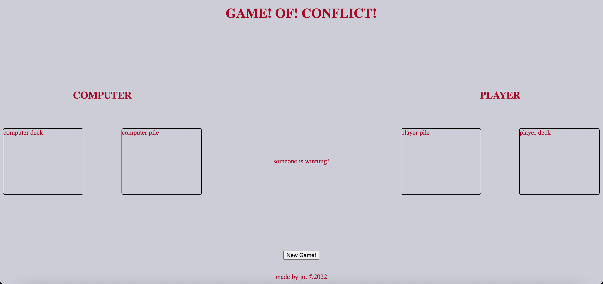

## Project-1:

### Game! Of! Conflict! desires to be a very simple, vintage inspired, browser-based game of the popular card game 'War'.

### The rules of the card game 'War' are quite simple. There are two players and each player gets half of a shuffled deck to work with. Each turn consists of the players turning over one card each and whoever's card has the highest value wins and gets both cards to add to the bottom of their deck. The face cards Jack, Queen, and King, as well as Ace, have the numeric values of 11, 12, 13, and 1, respectively. If both players flip cards of the same value, it is a tie. The tie will be broken by each player placing three cards facedown and a fourth card face up. Whichever card has the greater value wins and again, all cards are given to the winning player to add to the bottom of their deck. Ultimately, the winner of the game is the player who ends up with all 52 cards.

## Screenshots:

## Technologies Used

### This game was built using HTML, CSS, and Javascript.

## Getting started

### https://github.com/joprice42/conflict

### Upon entering the game the board is set. The player can click on their deck pile to flip their card. Text will read between the two deck piles of who wins each round, as well as overall and if there is a tie. Once the game is over the player has an opportunity to play again by clicking the 'New Game!' button.

## Next Steps:

### -complete the game.

### -add more styling to help make the board and theme more cohesive, including animated text.

### -when the cursor hovers over the player deck change it to a pointer cursor.

### -add celebratory animation when someone has ultimately one and the game is over.

### -add text to the tie function of the game (ie. the motto, "I, Declare, War!" when the three cards are being laid facedown before the fourth is flipped.)
